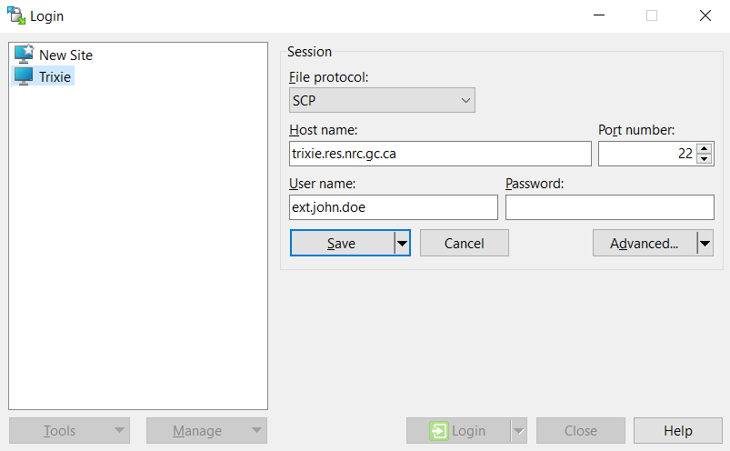

# Overview

This document will describe various procedures for transferring files to and from Trixie.

**Important Note:** For external users, before proceeding with this configuration, please ensure that you have performed the [external access setup](External-Access-Setup.md) and [advanced configuration](External-Access-Advanced-Configuration.md) procedures.

# Transfers Between Your Local Computer and Trixie

The following sections detail how to transfer files between your local computer and Trixie. They basically rely on advanced SSH configurations to bridge the network between your local computer and Trixie.

## Mac OSX / Linux

To copy a file to the Trixie server, please use the **scp** command on your local machine.

### External Users

Please note that the use of this method requires that your system be configured as detailed in the [advanced configuration](External-Access-Advanced-Configuration.md) in order to provide a direct link between your local machine and the Trixie server.

The following command will copy the file ``test.txt`` from John Doe’s local machine to his **admin.john.doe** account on Trixie. Please note that using **trixie** as the hostname will only work if you have configured SSH to use **ProxyJump** as detailed in the [advanced configuration](External-Access-Advanced-Configuration.md).

``scp test.txt trixie:/home/admin.john.doe``

To copy a file from Trixie to your local machine, you basically reverse the arguments to the **scp** command.

``scp trixie:/home/admin.john.doe/test.txt test.txt``

To copy an entire directory instead of just a file, please use the **–r** option (for recursive) to the **scp** command.

``scp –r myWorkFilesDir trixie:/home/admin.john.doe``

### Internal Users

The following command will copy the file ``test.txt`` from John Doe’s local machine to his account on Trixie. Please note that the example assumes the username on Trixie is different than the username on the local machine.

``scp test.txt doej@trixie.res.nrc.gc.ca:/home/doej``

To copy a file from Trixie to your local machine, you basically reverse the arguments to the **scp** command.

``scp doej@trixie.res.nrc.gc.ca:/home/doej/test.txt test.txt``

To copy an entire directory instead of just a file, please use the **–r** option (for recursive) to the **scp** command.

``scp –r myWorkFilesDir doej@trixie.res.nrc.gc.ca:/home/doej``

## Windows Using *WinSCP*

To copy a file to the Trixie server, please use the **WinSCP** command on your local machine.

### External Users

If you need to install **WinSCP** then please download and install it from [this site](https://winscp.net/eng/download.php)

First you will need to configure **WinSCP** to connect to Trixie using an SSH tunnel. Open **WinSCP** and follow the procedure below to configure it to access Trixie via an SSH tunnel.

1. Click the **New Session** button

    
2. In the window that pops up, perform the following

   1. Make sure the **File protocol** is set to *SCP*
   2. Set the **Host name**: *trixie.res.nrc.gc.ca*
   3. Set the **User name**: *\<admin.firstname.lastname>*` `
      The window should now look similar to the following

       
   4. Click the **Advanced** button
3. In the window that pops up, perform the following

   1. Click the **Tunnel** item in the left pane
   2. Select the **Connect through SSH tunnel** option
   3. Set **Host name**: *trixie.nrc-cnrc.gc.ca*
   4. Set **User name**: *\<username>``@pub.nrc-cnrc.gc.ca* ` `
      The window should now look similar to the following

       
   5. Click the **OK** button
4. Click the **Save** button in the previous popup window
5. In the window that pops up, perform the following

   1. Type in a **Site name** - perhaps *Trixie* ` `
      The window should now look similar to the following

       
   2. Click the **OK** button
6. Click the **Login** button in the previous popup window ` `
   You will be prompted to authenticate with **LoginTC** (you will need to type **1**) and both your **Pub** and **Trixie** passwords
7. Once you are logged into your session, you can drag and drop the files you need to transfer between the two file listings

### Internal Users

If you need to install **WinSCP** then please install it from the **NRC Software Portal** on your desktop.

First you will need to configure **WinSCP** to connect to Trixie. Open **WinSCP** and follow the procedure below to configure it to access Trixie.

1. Click the **New Session** button

    
2. In the window that pops up, perform the following

   1. Make sure the **File protocol** is set to *SCP*
   2. Set the **Host name**: *trixie.res.nrc.gc.ca*
   3. Set the **User name**: *\<username>*` `
      The window should now look similar to the following

       
   4. Click the **Save** button
3. In the window that pops up, perform the following

   1. Type in a **Site name** - perhaps *Trixie* ` `
      The window should now look similar to the following

       
   2. Click the **OK** button
4. Click the **Login** button in the previous popup window ` `
   You will be prompted to authenticate with your **Trixie** password
5. Once you are logged into your session, you can drag and drop the files you need to transfer between the two file listings

## Windows Using the *pscp* Command From Putty

To copy a file to the Trixie server, please use the **pscp** command on your local machine.

### External Users - this process does not work at the moment

Please note that the use of this method requires that you have two Putty profiles defined.

1. A profile for the bastion server
2. A profile for the Trixie server

#### Bastion Server Profile

The bastion server profile was likely created during the setup configuration for your external access to Trixie. If not, then please see the [initialize SSH connection section](External-Access-Setup.md#initialize-ssh-connection-with-windows) for detailed instructions on creating a profile for the bastion server.

#### Trixie Server Profile

Follow the procedure below to create the Trixie server profile.

Under **Session**

1. Set **Host Name (or IP address)**: *\<admin.firstname.lastname>``@trixie.res.nrc.gc.ca*
2. Set **Port**: *22*
3. Add a name for **Saved Sessions** – perhaps *Trixie-pscp*

    
4. Click **Save**

Once you have the profiles created and saved, please follow the procedure below to run the **pscp** command.

1. Load the *Bastion* profile and click **Open**
2. Login to the bastion server and leave the window open
3. Open a **Command Prompt** window
4. Use the **pscp** command in the **Command Prompt** window to copy files to or from the trixie server using the *Trixie-pscp* putty profile

   1. Copy the file ``test.txt`` from John Doe’s local machine to his **admin.john.doe** account on trixie

      ``pscp test.txt Trixie-pscp:/home/admin.john.doe``
   2. To copy a file from trixie to your local machine, you basically reverse the arguments to the **pscp** command

      ``pscp Trixie-pscp:/home/admin.john.doe/test.txt test.txt ``
   3. To copy an entire directory instead of just a file, please use the **–r** option (for recursive) to the **pscp** command

      ``pscp –r myWorkFilesDir Trixie-pscp:/home/admin.john.doe``

### Internal Users

Please note that the use of this method requires that you have a Putty profile defined to access the Trixie server. Follow the procedure below to create the Trixie server profile.

Under **Session**

1. Set **Host Name (or IP address)**: *\<username>``@trixie.res.nrc.gc.ca*
2. Set **Port**: *22*
3. Add a name for **Saved Sessions** – perhaps *Trixie-pscp*

    
4. Click **Save**

Once you have the profile created and saved, please follow the procedure below to run the **pscp** command.

1. Open a **Command Prompt** window
2. Use the **pscp** command in the **Command Prompt** window to copy files to or from the trixie server using the *Trixie-pscp* putty profile

   1. Copy the file ``test.txt`` from John Doe’s local machine to his **doej** account on trixie

      ``pscp test.txt Trixie-pscp:/home/doej``
   2. To copy a file from trixie to your local machine, you basically reverse the arguments to the **pscp** command

      ``pscp Trixie-pscp:/home/doej/test.txt test.txt ``
   3. To copy an entire directory instead of just a file, please use the **–r** option (for recursive) to the **pscp** command

      ``pscp –r myWorkFilesDir Trixie-pscp:/home/doej``

# Transfers Between Trixie and Another HPC Cluster

### Needs verification that this is accurate and works, as well as real parameters for the command lines please

The procedures in this section assume that the advanced SSH configurations discussed above have been implemented. There are three options for copying files between Trixie and another HPC cluster

1. Copy files directly between Trixie and the HPC cluster
2. Login to Trixie from the other HPC cluster
3. Copy files through your local computer

## Copy Files Directly

This procedure requires that there is an approved network flow open between Trixie and the second HPC cluster. Please see the external HPC systems page for [a list of approved external HPC systems](External-HPC-Systems.md#approved-external-systems). If there is an approved network flow, then files can be directly copied between Trixie and the second HPC cluster. This is the ideal situation and should be the fastest option in terms of overall network speed between the two systems.

To copy a file from the second HPC cluster to Trixie, use the following **scp** command on the Trixie server.

``scp username@cluster.domain:/home/username/test.txt test.txt``

To copy a file from Trixie to the second HPC cluster, you basically reverse the arguments to the **scp** command.

``scp test.txt username@cluster.domain:/home/username/test.txt``

To copy an entire directory instead of just a file, please use the **–r** option (for recursive) to the **scp** command.

``scp –r myWorkFilesDir username@cluster.domain:/home/username/folder``

## Login to Trixie From Second Cluster

This procedure requires that you have an external account setup to access Trixie. If this is the case, then files can be copied between Trixie and the second HPC cluster via the Bastion Host, but without flowing through your local computer. To use this approach, you will need to login to the second HPC cluster first, and then from the second HPC cluster computer, login to Trixie through the Bastion host.

To copy a file from the second HPC cluster to Trixie, use the following **scp** command on the Trixie server.

``scp username@cluster.domain:/home/username/test.txt test.txt``

To copy a file from Trixie to the second HPC cluster, you basically reverse the arguments to the **scp** command.

``scp test.txt username@cluster.domain:/home/username/test.txt``

To copy an entire directory instead of just a file, please use the **–r** option (for recursive) to the **scp** command.

``scp –r myWorkFilesDir username@cluster.domain:/home/username/folder``

## Copy Files Through Your Local Computer

This procedure requires that you copy files between the two clusters using your local computer as a bridge. The commands below should be executed on your local computer and not either of the cluster servers.

To copy a file from the second HPC cluster to Trixie, use the following **scp** command on your local computer.

``scp username@cluster.domain:/home/username/test.txt trixie:/home/admin.john.doe/test.txt``

To copy a file from Trixie to the second HPC cluster, you basically reverse the arguments to the **scp** command.

``scp trixie:/home/admion.john.doe/test.txt username@cluster.domain:/home/username/test.txt``

To copy an entire directory instead of just a file, please use the **–r** option (for recursive) to the **scp** command.

``scp –r trixie:/home/admin.john.doe/myWorkFilesDir username@cluster.domain:/home/username/folder``

# Copy Files to a Project Folder

Project folders have been created for users to use for a couple of purposes:

1. Storage of data files to use with Trixie. Although you can use your home directory for limited storage of files, it is strongly recommended that you use the project folder instead as there are higher disk quotas for project folders.
2. Sharing of project work and files with team members

Please note that users should be diligent and remove any files and folders (in both the project folder and your home folder) once they are no longer required. This helps to optimize disk usage and avoid disk space issues for all users, not just your own usage.

The project folder can be found under the following folder hierarchy

``/gpfs/projects/<project-group>/<project>``

Where **project-group** is the name of your project group – for example, **AI4D** or **COVID** - and **project** is the name of your project – for example, **core-01** or **bio-01**.

To copy files to a project folder you should create a personal folder under the project directory and then copy files from your home directory to the new folder. In the example below user **John Doe** will copy two dataset files to the **AI4D/bio-01** project folder.

1. Change directory to the project folder

   ``cd /gpfs/projects/AI4D/bio-01``
2. Create the new folder using a unique name, perhaps your last name and first initial

   ``mkdir doej``
3. Change back to your home directory

   ``cd``
4. Copy the files to your new project directory

   ``cp dataset1.dat dataset2.dat /gpfs/projects/AI4D/bio-01/doej``

# Related Topics

[External Access Setup](External-Access-Setup.md)

[External Access Advanced Configuration](External-Access-Advanced-Configuration.md)
