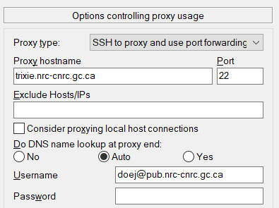

# Overview

To ease usage of the bastion host to easily connect to Trixie, there are some steps which can be
taken, especially making use of the SSH **ProxyJump** and **ControlMaster** parameters. Basically,
you need to configure SSH to automatically connect with the Trixie server using the bastion host as
a connector between your local computer and the Trixie server.

**Important Note:** Before proceeding with this configuration, please ensure that you have
performed the [Internal Access Setup](Internal-Access-Setup.md) procedure.

# Mac OSX / Linux

To configure SSH to automatically connect to the Trixie server, please open your ``.ssh/config``
file with your preferred text editor and add the following lines on your local machine – not the
servers – while substituting your given usernames in the **User** directive. You will also need to
create the folder ``.ssh/sockets`` to complete the configuration.

```
Host trixie-bastion
  HostName trixie.nrc-cnrc.gc.ca
  User <username>@pub.nrc-cnrc.gc.ca 
  ControlMaster auto
  ControlPath ~/.ssh/sockets/%r@%h-%p

Host trixie
  HostName trixie.res.nrc.gc.ca 
  User <username>
  ProxyJump trixie-bastion
```

Once your settings are configured, you will be able to login to the Trixie server with the
following command

``ssh trixie``

Please note that you will be prompted as follows

1. *LoginTC* prompt – enter 1
1. Prompt for your **PUB** password
1. Prompt for your **SRN** password

# Windows – Putty

To configure SSH to automatically connect to the Trixie server, please set the following settings
in your Putty application, substituting your username where applicable.

1. Under **Connection -> SSH**
      1. Set **Remote command**: ``ssh –A –Y <username>@trixie.res.nrc.gc.ca``
      1. Select the option **Share SSH connections if possible** – this will enable you to
         establish multiple connections to Trixie<br>
      <br>
1. Under **Connection -> SSH -> X11**
      1. Select the option **Enable X11 forwarding**<br>
      <br>
1. Under **Session**
      1. Set **Host Name (or IP address)**: *<username\>@pub.nrc-cnrc.gc.ca@trixie.nrc-cnrc.gc.ca*
      1. Set **Port**: *22*
      1. Add a name for **Saved Sessions** – perhaps *Trixie*<br>
      <br>
1. Click **Save**

Once the settings have been saved, you can double click on the name in the list of
**Saved Sessions** to open a session to the Trixie server. Please note that you will be prompted as
follows

1. *LoginTC* prompt – enter 1
1. Prompt for your **PUB** password
1. Prompt for your **SRN** password

# Related Topics

[Internal Access Setup](Internal-Access-Setup.md)<br>
[External Access Setup](External-Access-Setup.md)<br>
[External Access Advanced Configuration](External-Access-Advanced-Configuration.md)<br>
[File Transfers](File-Transfers.md)
