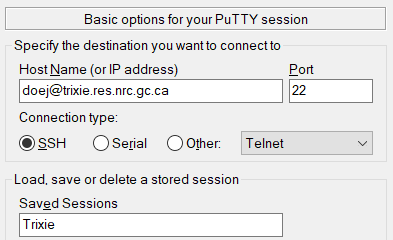
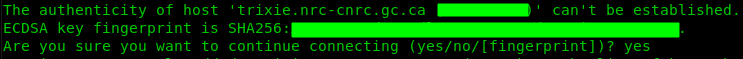
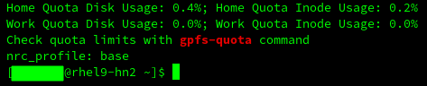
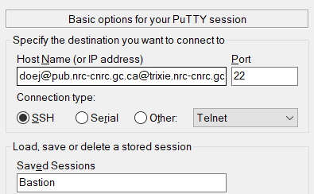
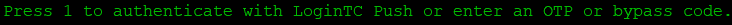
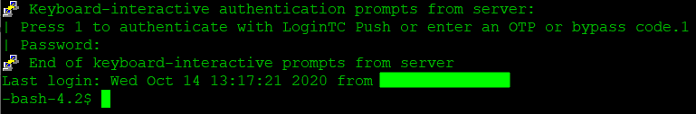
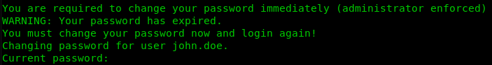
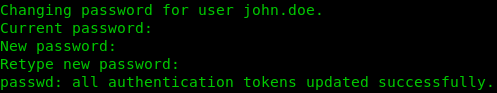

# Internal Access Setup

## Overview

As an internal NRC employee, you can access the AI for Design (Trixie) Cluster using your
**SRN** credentials. On your first login, you may be required to change your password. 
**Please note:** during the password change, the first prompt asks for a confirmation of your
existing password prior to requesting a new one.

In order to access Trixie, you will need to use an SSH client. Please note that you cannot access
Trixie using a web browser. On Mac OSX and Linux, SSH is installed by default. On Windows you will
need to install Putty if it is not installed already. You can install Putty from the
*NRC software portal* which should be an icon on your Windows desktop.

Trixie can only be accessed from one of two ways

1. The Secure Research Network (**SRN**)
1. The **Legacy** network using the bastion host

The following sections will detail the procedures for logging into Trixie from these networks.

## Logging in From the SRN Network

In order to access Trixie from the **SRN** network, you can login to Trixie directly with an SSH
client.

### Initialize SSH Connection with Mac OSX / Linux

For Mac OSX and Linux you can open a new terminal and connect to ``trixie.res.nrc.gc.ca`` via ssh
using your **SRN** credentials and the following command, where ``<username>`` is your **SRN** user
ID consisting of your lastname followed by one or more initials of your first name - like ``doej``
for John Doe.

``ssh -l <username> trixie.res.nrc.gc.ca``

### Initialize SSH Connection with Windows

For Windows, you can create a Putty profile to SSH into Trixie. Note that ``<username>`` is your
**SRN** user ID consisting of your lastname followed by one or more initials of your first
name - like ``doej`` for John Doe.

Under **Session**

1. Set **Host Name (or IP address)**: *<username\>@trixie.res.nrc.gc.ca*
1. Set **Port**: *22*
1. Add a name for **Saved Sessions** – perhaps *Trixie* 
    
1. Click **Save**

Once the settings have been saved, you can double click on the name in the list of
**Saved Sessions** to open a session to Trixie.

### Logging into Trixie - a Tutorial

In the following procedure, the information printed in the images may not be the same as what you
will see when you login. However the steps will be the same.

Please perform the following steps to access Trixie.

1. From the terminal prompt, use SSH to log into ``trixie.res.nrc.gc.ca`` with your **SRN** account
   and password with a similar command as the following. 
   ``ssh <username>@trixie.res.nrc.gc.ca``
1. If a message similar to the one below appears, then simply type in **yes** to the prompt as
   shown below 
   
1. Once you have successfully logged in, you will be logged into Trixie – your screen should look
   similar to the following 
    

**NOTE 1:** After successful authentication, you should see the Trixie cluster login banner with
the terms of use and be placed in a shell in your home directory on the cluster, similar to the
image above.

**NOTE 2:** You will be placed in your home directory which only you have access to. For more
information on the cluster and its usage, please see the:

[Home Page](index.md)

## Logging in From the Legacy Network

In order to access Trixie from the **Legacy** network, you will need to use an SSH client to login
to a bastion host with the *LoginTC* authentication application.

### Accessing Trixie with LoginTC 2-Factor Authentication

LoginTC is an authentication application that you should have installed on your mobile phone. It
implements a two-factor authentication system for secure access to Trixie.

#### LoginTC Application Setup

Before you attempt your first login, the following initial installation and configuration of
*LoginTC* must be implemented.

* You should have received an email to setup and initialize the *LoginTC* application
  (for iOS, Android, or the Chrome web browser)
* Set up *LoginTC* using the directions provided to you by email

#### Initialize SSH Connection with Mac OSX / Linux

For Mac OSX and Linux you can open a new terminal and connect to ``trixie.nrc-cnrc.gc.ca`` via ssh
using your **PUB** account and the following command, where ``<username>`` is your **SRN** user ID
consisting of your lastname followed by one or more initials of your first name - like ``doej`` for
John Doe.

``ssh -l <username>@pub.nrc-cnrc.gc.ca trixie.nrc-cnrc.gc.ca``

**TIP 1:** Your **PUB** password is the same password you use to connect to the Legacy VPN.

**TIP 2:** Some users have reported that using `doej` did not work for their username. Please try
using the first.last format - for example `john.doe` - for your username if `doej` doesn't work
for you

#### Initialize SSH Connection with Windows

For Windows, you can create a Putty profile to SSH into the bastion server. Note that ``<username>``
is your **PUB** user ID consisting of your lastname followed by one or more initials of your first
name - like ``doej`` for John Doe.

**TIP 1:** Your **PUB** password is the same password you use to connect to the Legacy VPN.

**TIP 2:** Some users have reported that using `doej` did not work for their username. Please try
using the first.last format - for example `john.doe` - for your username if `doej` doesn't work
for you

Under **Session**

1. Set **Host Name (or IP address)**: *<username\>@pub.nrc-cnrc.gc.ca@trixie.nrc-cnrc.gc.ca*
1. Set **Port**: *22*
1. Add a name for **Saved Sessions** – perhaps *Bastion* 
    
1. Click **Save**

Once the settings have been saved, you can double click on the name in the list of
**Saved Sessions** to open a session to the bastion server.

#### Logging into Trixie - a Tutorial

In the following procedure, the information printed in the images may not be the same as what you
will see when you login. However the steps will be the same.

Please perform the following steps to access Trixie.

1. When you login using one of the methods above, you will be prompted to authenticate with your
   *LoginTC* application. The message should appear as follows: 
   
1. Press **1** followed by the **Enter** key and then check your *LoginTC* device as setup above to
   approve the login request
1. If a message similar to the one below appears, then simply type in **yes** to the prompt as
   shown below 
   
1. Once you have successfully logged in, you will be logged into the bastion server – your screen
   should look similar to the following 
   
1. You will need to login to Trixie next. From the bash prompt, use SSH to log into
   ``trixie.res.nrc.gc.ca`` with your **SRN** account and password with a similar command as the
   following. 
   ``ssh <username>@trixie.res.nrc.gc.ca``
1. If a message similar to the one below appears, then simply type in **yes** to the prompt as
   shown below 
   
1. Once you have successfully logged in, you will be logged into Trixie – your screen should look
   similar to the following 
    

**NOTE 1:** After successful authentication, you should see the Trixie cluster login banner with
the terms of use and be placed in a shell in your home directory on the cluster, similar to the
image above.

**NOTE 2:** You will be placed in your home directory which only you have access to. For more
information on the cluster and its usage, please see the:

[Home Page](index.md)

## Changing passwords

Passwords on the **PUB** and **SRN** accounts expire after a certain amount of time and must be
changed. If you do not change your password, you could be locked out of the system.

Watch for the pop-up message notifying you to change your password, or set yourself a reminder to
change your password every so often - perhaps every 90 days.

### Being Forced to Change Your Password

If your password has expired, or you are using a password for the first time, then the system will
likely force you to change your password. Please note that you will
**be prompted for your original (or current) password first** and then you will be prompted to
enter your new password twice.

The following is an example of the system forcing you to change your password

1. During a login session you will be prompted to enter your password and then the system forces
   you to change your password. You should see a message similar to the one below – remember to
   enter your original password first and then enter your new password twice. 
   
1. The system will automatically log you out, thus, you will need to login again using your new
   password

### Change Your **PUB** Password

You can change your **PUB** password by logging into the following website. The site allows you to
manage your **PUB** account. Please use one of the following formats for your username

* `john.doe@pub`
* `doej@pub`

[PUB Account Management](https://login-connexion.nrc-cnrc.gc.ca)

Please note that the **Reset Password** feature will not work if you do not fill in the security
questions on the website. Therefore it is **strongly recommended** that you fill in the security
questions so that you can reset your password if necessary.

### Change Your SRN Password via Linux Terminal

1. Ensure you are logged into the Trixie server (trixie.res.nrc.gc.ca)
1. Type **passwd** then hit **Enter**
1. You will be prompted for your original (or current) password first and then you will be prompted
   to enter your new password twice. You should see a message similar to the one below – remember
   to enter your original password first and then enter your new password twice. 
    
1. The system will automatically log you out, thus, you will need to login again using your new
   password

## Related Topics

[Internal Access Advanced Configuration](Internal-Access-Advanced-Configuration.md) 
[External Access Setup](External-Access-Setup.md) 
[External Access Advanced Configuration](External-Access-Advanced-Configuration.md) 
[File Transfers](File-Transfers.md)
