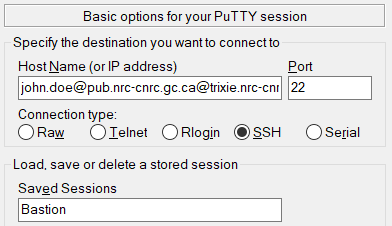

# Overview

As an internal NRC employee, you can access the AI for Design (Trixie) Cluster using your
**SRN/RES** credentials. On your first login, you may be required to change your password.
**Please note:** during the password change, the first prompt asks for a confirmation of your
existing password prior to requesting a new one.

In order to access Trixie, you will need to use an SSH client. Please note that you cannot access
Trixie using a web browser. On Mac OSX and Linux, SSH is installed by default. On Windows you will
need to install Putty if it is not installed already. You can install Putty from the NRC software
portal which should be an icon on your Windows desktop.

Trixie can only be accessed from one of two ways

1. The **SRN** network
1. The **Legacy** network using the bastion host

The following sections will detail the procedures for logging into Trixie from these networks.

# Logging in From the SRN Network

In order to access Trixie from the **SRN** network, you can login to Trixie directly with an SSH
client.

## Initialize SSH Connection with Mac OSX / Linux

For Mac OSX and Linux you can open a new terminal and connect to ``trixie.res.nrc.gc.ca`` via ssh
using your **SRN** credentials and the following command

``ssh -l <username> trixie.res.nrc.gc.ca``

## Initialize SSH Connection with Windows

For Windows, you can create a Putty profile to SSH into Trixie.

Under **Session**

1. Set **Host Name (or IP address)**: *<username\>@trixie.res.nrc.gc.ca*
1. Set **Port**: *22*
1. Add a name for **Saved Sessions** – perhaps *Trixie* 
    
1. Click **Save**

Once the settings have been saved, you can double click on the name in the list of
**Saved Sessions** to open a session to Trixie.

# Logging in From the Legacy Network

### DONE TO HERE ###

In order to access Trixie from the **Legacy** , you will need to use an SSH client. Please note that you cannot access
Trixie using a web browser. On Mac OSX and Linux, SSH is installed by default. On Windows you will
need to install Putty if it is not installed already. You can install Putty from the NRC software
portal which should be an icon on your Windows desktop.

# Accessing Trixie with LoginTC 2-Factor Authentication

For Mac OSX and Linux you can open a new terminal and connect to ``trixie.nrc-cnrc.gc.ca`` via ssh
using your **PUB** account and the following command

``ssh -l <firstname.lastname>@pub.nrc-cnrc.gc.ca trixie.nrc-cnrc.gc.ca``

## Initialize SSH Connection with Windows

For Windows, you can create a Putty profile to SSH into the bastion server

Under **Session**

1. Set **Host Name (or IP address)**: *<firstname.lastname\>@pub.nrc-cnrc.gc.ca@trixie.nrc-cnrc.gc.ca*
1. Set **Port**: *22*
1. Add a name for **Saved Sessions** – perhaps *Bastion* 
    
1. Click **Save**

Once the settings have been saved, you can double click on the name in the list of
**Saved Sessions** to open a session to the bastion server.

# LoginTC Application Setup

Before you attempt your first login, the following initial installation and configuration of
*LoginTC* must be implemented.

* Upon user creation, you will receive an email to setup and initialize the *LoginTC* application
  (for iOS, Android, or the Chrome web browser) which is used as a second factor authentication
  into Trixie
* Set up *LoginTC* using the directions provided to you by email

## Logging in for the First Time

When you login for the first time you will be forced to change your password for both your **PUB**
account and your Trixie **ext** account. Please note that when you do this, you will
**be prompted for your original (or current) password first** and then you will be prompted to
enter your new password twice.

In the following procedure, the information printed in the images may not be the same as what you
will see when you login. However the steps will be the same.

Please perform the following steps to access Trixie.

1. When you login using one of the methods above, you will be prompted to authenticate with your
   *LoginTC* application. The message should appear as follows: 
   
1. Press **1** followed by the **Enter** key and then check your *LoginTC* device as setup above to
   approve the login request
1. If a message similar to the one below appears, then simply type in **yes** to the prompt as
   shown below 
   
1. After you complete the two-factor authentication process in *LoginTC* you will be prompted to
   enter your **PUB** account password and then you will be forced to change your password. You 
   should see a message similar to the one below – remember to enter your original password first
   and then enter your new password twice. 
   
1. The system will automatically log you out, thus, you will need to login again using your new
   password
1. Once you have successfully logged in, you will be logged into the bastion server – your screen
   should look similar to the following 
   
1. If you have your credentials for the ``trixie.res.nrc.gc.ca`` server you can skip this step.
   Otherwise, you will now need to contact the administrator who provided you with your credentials
   for the bastion server to obtain your credentials for the Trixie server
1. You will need to login to Trixie next. From the bash prompt, use SSH to log into
   ``trixie.res.nrc.gc.ca`` with your Trixie **ext.<firstname.lastname\>** account and password
   with a similar command as the following. 
   ``ssh ext.<firstname.lastname>@trixie.res.nrc.gc.ca``
1. If a message similar to the one below appears, then simply type in **yes** to the prompt as
   shown below 
   
1. You will be prompted to enter your Trixie **ext** account password and then you will be
   forced to change your password. You should see a message similar to the one below – remember to
   enter your original password first and then enter your new password twice. 
    
1. The system will automatically log you out, thus, you will need to login again using your new
   password
1. Once you have successfully logged in, you will be logged into Trixie – your screen should look
   similar to the following 
    

After successful authentication, you should see the Trixie cluster login banner with terms and be
placed in a shell in your home directory on the cluster, similar to the image above.

Note that you will be placed in your home directory which only you have access to. For more
information on the cluster and its usage, please see the:

[Home Page](index.md)

# Changing passwords

Passwords on the **PUB** and **RES** accounts expire after 90 days and must be changed. If you do
not change your password, you will be locked out of the system.

Watch for the pop-up message notifying you to change your password, or set yourself a reminder to
change your password before the 90-day expiry.

If you get locked out of your account due to an expired password for any account, notify your NRC
contact who can have the password reset.

## Change Your **PUB** Password

You can change your **PUB** password by logging into the following website. The site allows you to
manage your **PUB** account. Please use the following format for your username ``john.doe@pub``

[PUB Account Management](https://login-connexion.nrc-cnrc.gc.ca)

Please note that the **Reset Password** feature will not work if you do not fill in the security
questions on the website. Therefore it is **strongly recommended** that you fill in the security
questions so that you can reset your password if necessary.

## Change Your Ext Password via Linux Terminal

1. Ensure you are logged into the Trixie server (trixie.res.nrc.gc.ca)
1. Type **passwd** then hit **Enter**
1. You will be prompted for your original (or current) password first and then you will be prompted
   to enter your new password twice. You should see a message similar to the one below – remember
   to enter your original password first and then enter your new password twice. 
    
1. The system will automatically log you out, thus, you will need to login again using your new
   password

# Related Topics

[External Access Advanced Configuration](External-Access-Advanced-Configuration.md)

[File Transfers](File-Transfers.md)
