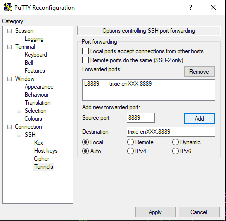

WARNING: DO NOT USE `miniconda3`!

# Experimentation - Jupyter Notebook

At the end of this tutorial you will have:

- created a "env" directory inside a project directory with:
  - an environment running keras using CPU(s)
  - an environment running keras using GPU(s)
- defined 2 slurm jobs starting jupyter making use of respective environment

### Creating conda environments

```bash
#load conda module
module load conda/3-24.9.0

#define a project variable
export MY_PROJECT_ROOT=$HOME/sample_project

#go to project root
cd $MY_PROJECT_ROOT

#create a directory for all the environments
mkdir env

#create the CPU variant
conda create -c conda-forge -p $MY_PROJECT_ROOT/env/Covid-Net-cpu python=3 jupyterlab imutils opencv
matplotlib keras scikit-learn pandas

#create the GPU variant
conda create -c conda-forge -p $MY_PROJECT_ROOT/env/Covid-Net-gpu python=3 jupyterlab imutils opencv
matplotlib keras scikit-learn pandas tensorflow-gpu

#create a directory to hold jobfiles
mkdir $MY_PROJECT_ROOT/jobs
```

### example of a $MY_PROJECT_ROOT/jobs/jupyter-cpu.job file

```bash
#!/bin/bash -l
#SBATCH --account=covid-01
#SBATCH --partition=TrixieMain
#SBATCH --time=04:00:00 ####MAXIMUM 48:00:00 on Trixie
#SBATCH --job-name=My_Awesome_Jupyter.cpu ####Try to be a bit descriptive or use the comment if you prefer shorter job names
##SBATCH --comment="Comment on job" ####Optional comment
#SBATCH --mem=5G
#SBATCH --nodes=1
#SBATCH --ntasks-per-node=1
#SBATCH --cpus-per-task=2
#SBATCH --output=%x-%j.out

##### To help debugging
#set -x

export MY_PROJECT_ROOT=$HOME/sample_project

module load conda/3-24.9.0

source activate $MY_PROJECT_ROOT/env/Covid-Net-cpu
jupyter-lab --ip=*
```

### example of a $MY_PROJECT_ROOT/jobs/jupyter-gpu.job file

```bash
#!/bin/bash -l
#SBATCH --account=covid-01
#SBATCH --partition=TrixieMain
#SBATCH --gres=gpu:1
#SBATCH --time=04:00:00 ####MAXIMUM 48:00:00 on Trixie
#SBATCH --job-name=My_Awesome_Jupyter.gpu ####Try to be a bit descriptive or use the comment if you prefer shorter job names
##SBATCH --comment="Comment on job" ####Optional comment
#SBATCH --mem=5G
#SBATCH --nodes=1
#SBATCH --ntasks-per-node=1
#SBATCH --cpus-per-task=2
#SBATCH --output=%x-%j.out

##### To help debugging
#set -x

export MY_PROJECT_ROOT=$HOME/sample_project

module load conda/3-24.9.0

source activate $MY_PROJECT_ROOT/env/Covid-Net-gpu

jupyter-lab --ip=*
```

### Scheduling a GPU enabled Jupyter notebook

```bash
#starting a GPU enabled Jupyter notebook
sbatch $MY_PROJECT_ROOT/jobs/jupyter-gpu.job
Submitted batch job 4502

#you will get a jobid look for your log file names based on the job-name and the jobid
tail -f My_Awesome_Jupyter.gpu-4502.out

#look for the Jupyter notebook output you will get the node it is running on and the port number it is listening on. for example:
#[...]
To access the notebook, open this file in a browser:
file:///gpfs/home/paulp/.local/share/jupyter/runtime/nbserver-24429-open.html
Or copy and paste one of these URLs:
http://cn122:8888/?token=388199bb6ef0cad54ef195f1286301548fc15ec2a39eee3c
or http://127.0.0.1:8888/?token=388199bb6ef0cad54ef195f1286301548fc15ec2a39eee3c

#At that moment a GPU enabled Jupyter notebook is running on compute node "cn122" on port 8888
#Using an ssh tunnel 8888:cn122:8888 (using the following ssh command from the hn2 command line prompt)
ssh -Y -R 8888:cn122:8888 hn2
#would allow you to access the remote jupyter notebook by connecting to
#http://127.0.0.1:8888/?token=388199bb6ef0cad54ef195f1286301548fc15ec2a39eee3c
```

:warning::warning::warning:

## Releasing Resources for others to use

```bash
#Don't forget to release resources when done by canceling your job
scancel 4502
```

:warning::warning::warning:

### sample python script that shows devices available to use by tensorflow 2.2.0

```python
import tensorflow as tf

#display tensorflow version
print(tf.__version__)

from tensorflow.python.client import device_lib

#output tensorflow devices
print(device_lib.list_local_devices())
```

### Useful tip

:bulb::bulb::bulb:

- check on the queue using "squeue" or "squeue -u $USER" - a running job will have the "R" state a job waiting to run will show "PD" in the state column
- you can as some information on the partitions using "sinfo"
- you can get some details on accounting using "sacct"
- The Terminal within jupyter-lab runs within your job so it is safe to use to perform monitoring or other tasks that could be bothersome to others if ran on the head node. If you intend to use a lot of resource like this consider raising how many cores/cpus you request and maybe the RAM also...
- a nice one liner to run a monitoring task for the GPU, this command will run indefinitely each second and output the listed parameters.

```bash
nvidia-smi --query-gpu=timestamp,name,pci.bus_id,driver_version,pstate,pcie.link.gen.max,pcie.link.gen.current,temperature.gpu,utilization.gpu,utilization.memory,memory.total,memory.free,memory.used --format=csv -l 1
```

:bulb::bulb::bulb:

## Making a SSH Tunnel Straight to the Node

This is somewhat of a rehash of the previous section but here's another way by creating a tunnel straight to the node.

### :material-head-question: ScientificPythonStack

`ScientificPythonStack` is essentially a community suggested set of commonly used python tools/libraries for scientific work.

```sh
pip install numpy scipy matplotlib ipython pandas sympy jupyterlab notebook
```

### SLURM job `jupyter.slurm`

This is an example `slurm` script to start a job running `jupyter`.
It uses 6 CPU cores and 16G or RAM.
In its current state, the following script doesn't ask for a GPU.
If you need a GPU, uncomment `##SBATCH --gres=gpu:1` to `#SBATCH --gres=gpu:1`.

```sh
#!/bin/bash
# vim:nowrap:

#SBATCH --job-name=Jupyter
#SBATCH --comment="Jupyter Notebook"

# On Trixie
#SBATCH --partition=JobTesting
#SBATCH --account=dt-mtp

##SBATCH --gres=gpu:1
#SBATCH --time=6:00:00
#SBATCH --nodes=1
#SBATCH --ntasks-per-node=1
#SBATCH --cpus-per-task=6
#SBATCH --mem=16G
#SBATCH --open-mode=append
#SBATCH --requeue
#SBATCH --signal=B:USR1@30
#SBATCH --output=%x-%j.out

# Fix SLURM environment variables.
SLURM_JOB_CPUS_PER_NODE=${SLURM_JOB_CPUS_PER_NODE%%(*)}   # '24(x2)' => 24
SLURM_TASKS_PER_NODE=${SLURM_TASKS_PER_NODE%%(*)}   # '4(x2)' => '4'

# NOTE: We set OMP_NUM_THREADS or else we get the following Warning:
# WARNING:torch.distributed.run:
# *****************************************
# Setting OMP_NUM_THREADS environment variable for each process to be 1 in
# default, to avoid your system being overloaded, please further tune the
# variable for optimal performance in your application as needed.
# *****************************************
export OMP_NUM_THREADS=${SLURM_CPUS_PER_TASK:-$(nproc)}

source /gpfs/projects/DT/mtp/venv/ScientificPythonStack/bin/activate ""

jupyter notebook --no-browser --port 8889  --ip=*
```

Then start the notebook.

```sh
sbatch jupyter.slurm
```

If you need a GPU, you can start your job using:

```sh
sbatch jupyter.slurm --gres=gpu:1
```

You will need to know on what node your job is running in order to properly setup a ssh tunnel to it.
Use `squeue --user $USER` to get the worker node name.

```sh
   JOBID NAME                               USER ST       TIME  NODES NODELIST(REASON) SUBMIT_TIME        COMMENT
   90324 Jupyter                         larkins  R       0:06      1 trixie-cn101     2024-11-21T10:06:2 Jupyter
```

### SSH Tunnel

#### Putty

To create a tunnel with `Putty` replacing `cnXXX` with your worker's hostname (trixie-cnXXX):



- right click putty's title bar
- Change Settings...
- Connection > SSH> Tunnels
- Source port `8889`
- Destination `trixie-cnXXX:8889`
- CLICK ADD
- then `Apply`

#### ssh

```sh
ssh -L 8889:trixie-cnXXX:8889 trixie.res.nrc.gc.ca
```

### Access your Jupyter Notebook

You can look at the log `tail -f Jupyter*.out` to grab your jupyter's url which has a secret token.
This url looks like `http://localhost:8889/tree?token=f3e7dee8b55e94912fb4769b4cb0896cc57eeaa1fb7b317d`.
Using your favorite browser, use the url to access your Jupyter Notebook.

### :material-alert-circle-check:{ .pulsing .important } Finally Stop your Worker

It is IMPORTANT to `scancel <JOBID>` when you are not using your jupyter notebook.
